

# 🎹 Synth Manos

**Haz música con las manos delante de la cámara, con la pantalla táctil o cantando en clase.**

Una app para las clases de música de primaria que funciona **sin internet** en Windows.

[**⬇️ Descargar para Windows**](https://github.com/JorgeJaraB/Synth/releases/latest/download/SynthManos-Instalador.exe)

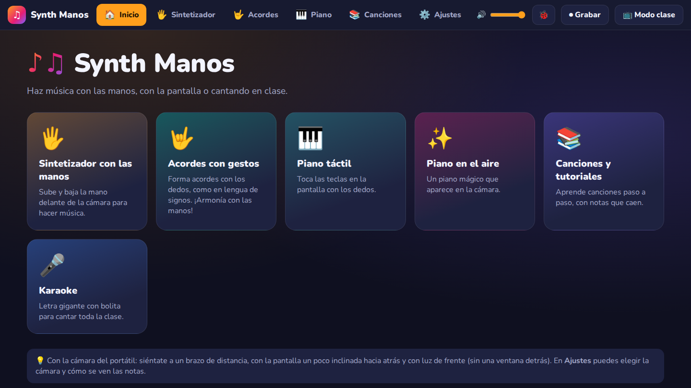

## ✨ Qué es

Synth Manos convierte el ordenador del aula en un instrumento. La cámara del portátil reconoce las manos y cada gesto suena: subir la mano cambia la nota, levantar dedos forma acordes y bajar un dedo toca una tecla. En los equipos con pantalla táctil también se toca con los dedos sobre la pantalla.

Trae canciones infantiles para aprender con tutoriales y karaoke, y se pueden añadir más arrastrando archivos o escribiéndolas en la propia app. Está pensada para proyectarla o compartir pantalla con los niños.

- 🔒 **Todo se queda en el ordenador.** La imagen de la cámara no se guarda ni se envía, y los vídeos grabados solo se guardan en el propio equipo.
- 🔄 **Se actualiza sola** al cerrarla.
- 🇪🇸 **En español**, con las notas en Do-Re-Mi, en C-D-E o con colores.

## 🎛️ Modos

### 🖐️ Sintetizador con las manos
Levanta el dedo índice y sube o baja la mano para cambiar de nota. Moverla a los lados cambia el sonido y con el puño cerrado se calla. Se puede tocar con **notas fijas**, que siempre suenan afinadas, o como un **theremin**, con el tono deslizándose.

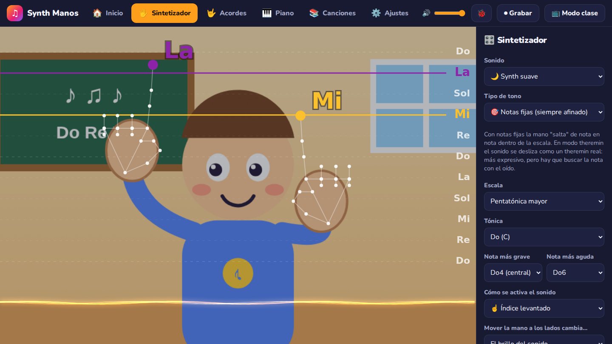

### 🤟 Acordes con gestos
Como en lengua de signos: con una mano formas el acorde levantando dedos (1 a 5 dedos = I a V, 🤘 = VI) y con la otra eliges cómo suena, más o menos fuerte o con séptima. Incluye un **tutorial paso a paso** que comprueba cada gesto con la cámara y progresiones para practicar.

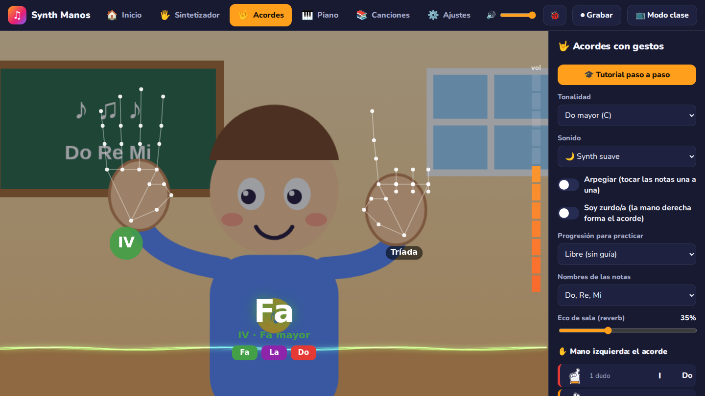

### 🎹 Piano táctil
Un teclado multitoque en la pantalla que también se toca con el ratón o con el teclado del ordenador. Las notas suben en colores mientras suenan.

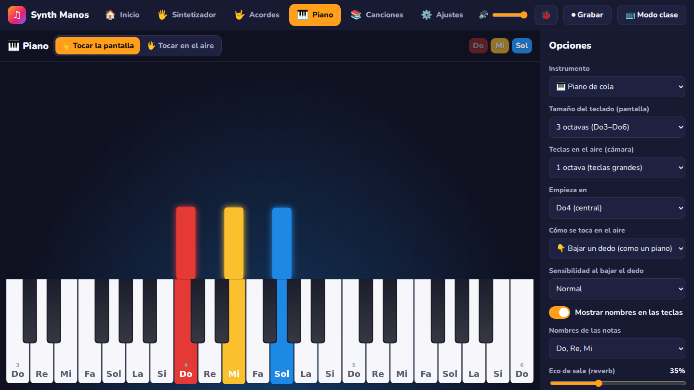

### ✨ Piano en el aire
Aparece un teclado en perspectiva abajo de la imagen de la cámara. Con las manos como sobre un piano, **baja un dedo** y suena la tecla que tiene debajo. Cuanto más rápido lo bajas, más fuerte suena.

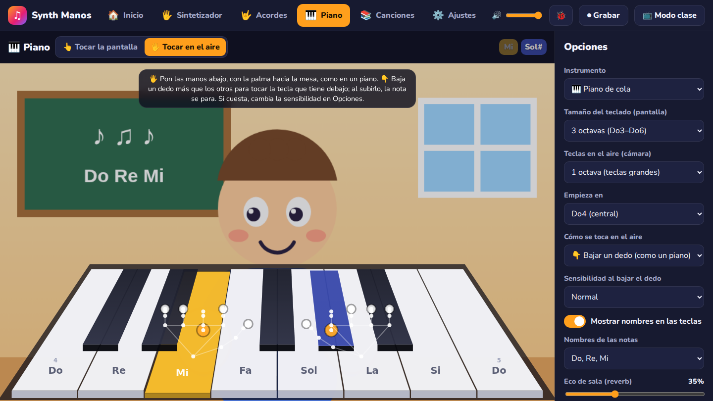

### 📚 Canciones
La biblioteca lee las canciones de una carpeta del ordenador y las ordena por categorías. Admite MIDI, karaoke (`.kar`) y partituras de MuseScore (MusicXML). Trae canciones populares de ejemplo, como *Estrellita*, *Cumpleaños feliz* o *La cucaracha*.

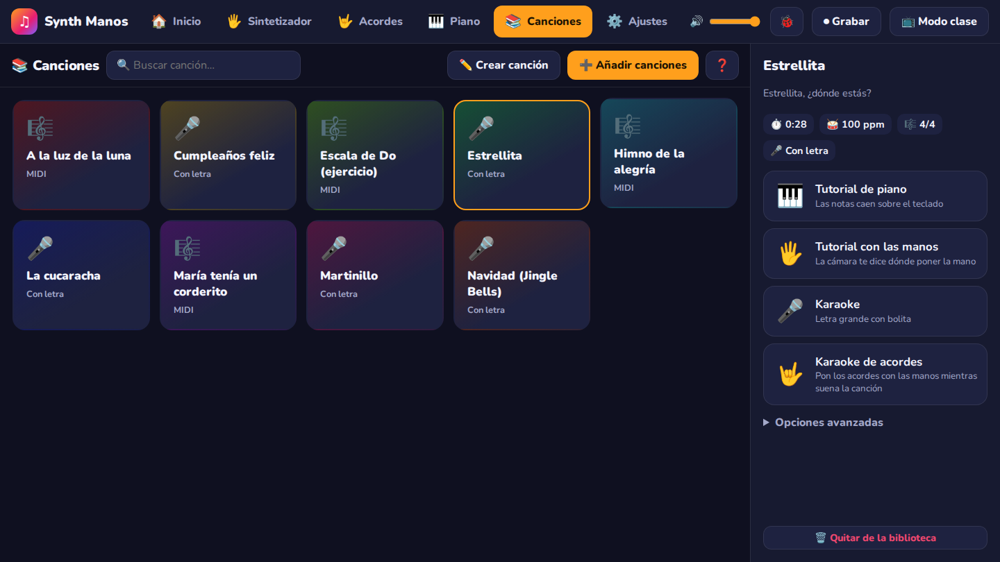

### 🎓 Tutorial de piano
Las notas caen sobre el teclado, como en los vídeos de piano de YouTube. Tiene tres modos: **👂 Escuchar**, **⏳ Practicar** (la canción espera a que toques la nota) y **⭐ Reto** (con puntos y estrellas).

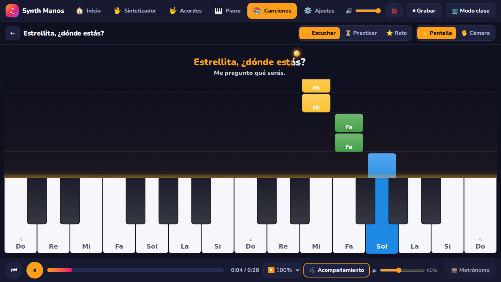

### 👆 Tutorial con las manos
La cámara indica dónde poner el dedo: un anillo brillante marca la altura de cada nota de la canción.

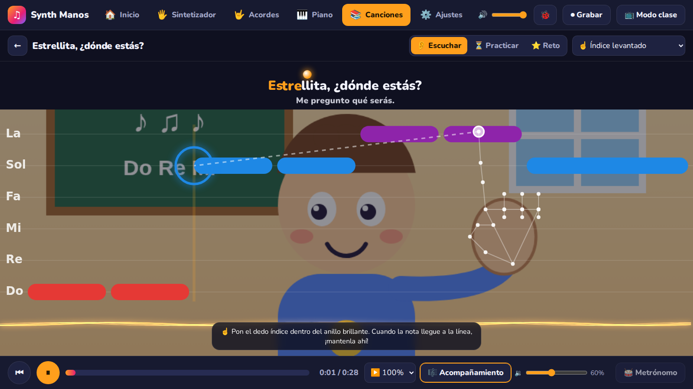

### 🎤 Karaoke
Letra gigante con una bolita que salta de sílaba en sílaba y la melodía en colores, para cantar toda la clase. Si la canción no tiene letra, se cantan los nombres de las notas.

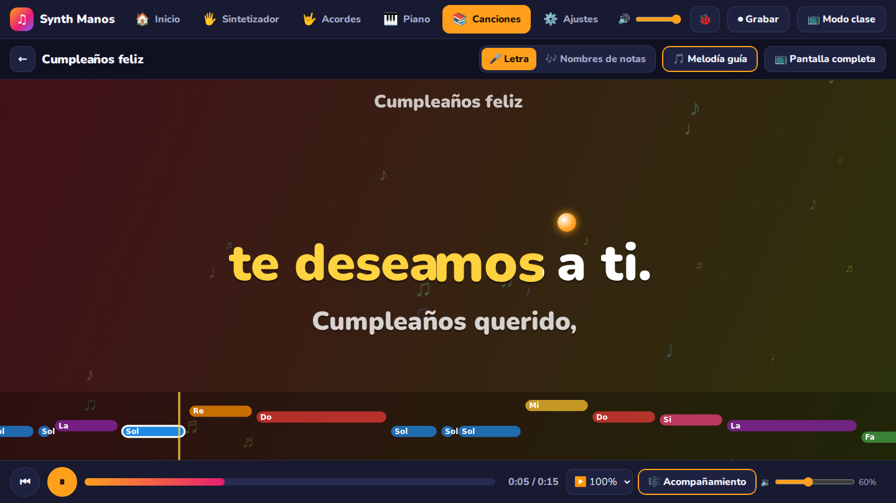

### 🎸 Karaoke de acordes
Suena la canción con su letra y los alumnos ponen los acordes con las manos. La app deduce los acordes y los muestra encima de la letra y en una cinta con el dibujo de cada gesto.

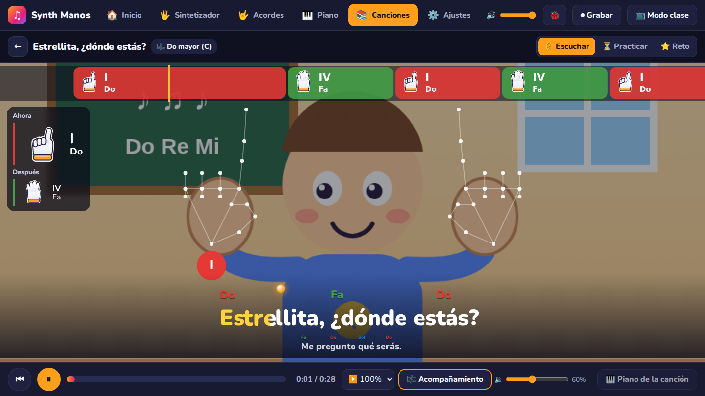

### ✏️ Crear canciones
Escribe las notas (`Do Do Sol Sol La La Sol-`) y la letra (`Es-tre-lli-ta`), escúchala y guárdala en la biblioteca, lista para los tutoriales y el karaoke.

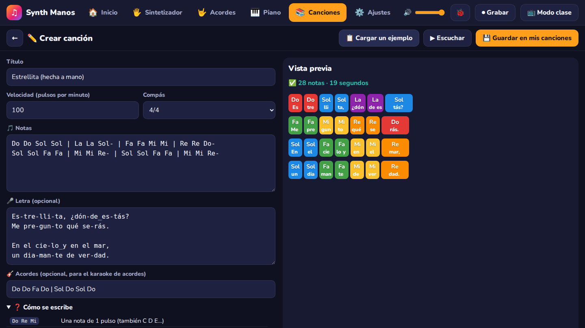

### Y además…
- **📺 Modo clase:** pantalla completa y sin menús, para proyectar o compartir pantalla.
- **⏺ Grabar vídeo:** graba la app con su sonido y guarda el vídeo en el ordenador.
- **🐞 Reportar un problema:** envía una sugerencia o un fallo sin necesidad de tener cuenta.

---

📖 Instalación, consejos para la cámara y detalles técnicos: [**guía completa**](docs/GUIA.md).

Detección de manos con MediaPipe · Sonido con Tone.js · Piano *Salamander Grand Piano* (CC-BY 3.0) · El modo de acordes está inspirado en <i>Gesture Synth</i> de Eric Wei · En las capturas, un monigote hace de alumno delante de la cámara.

